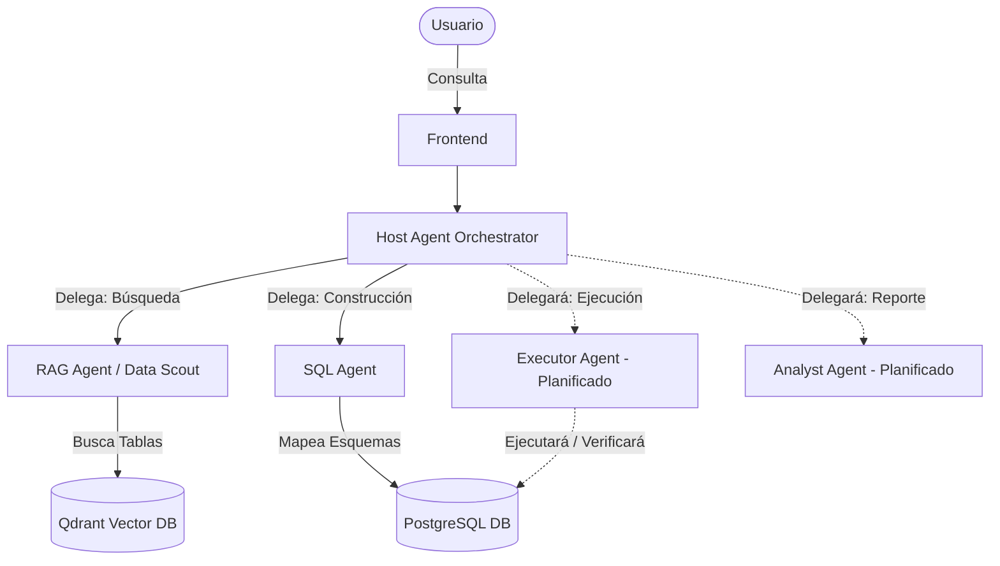

# Analyst DATAX

DATAX es una empresa boliviana dedicada a la recoleccion, limpieza y analisis de datos. Actualmente enfrentan un desafio importante: la empresa posee un datawarehouse gigante estructurado en modelo estrella. La intencion de este proyecto es obtener un bot conversacional inteligente que sea capaz de procesar las consultas del usuario en lenguaje natural y devolver un informe analitico completo de lo solicitado extraido directamente de la base de datos empresarial.

Para resolver este problema nace Analyst DATAX. Este es un sistema robusto Multi-Agente RAG (Generacion Aumentada por Recuperacion) diseñado para interactuar de forma inteligente con este tipo de estructuras de bases de datos jerarquicas. Utiliza una arquitectura especializada compuesta por multiples agentes distintos que colaboran para interpretar consultas en lenguaje natural, identificar las tablas de base de datos relevantes mediante busqueda semantica, generar consultas SQL precisas y ofrecer visualizaciones o respuestas a traves de una interfaz de usuario moderna.

## Caracteristicas Principales

- Arquitectura Multi-Agente: Distribuye las tareas entre agentes especializados para maximizar la precision y la eficiencia.
- Metadata Estructurada: Se diseño y estructuro una metadata especifica para guiar al bot sobre la existencia de datos en el sistema y enseñarle detalladamente la estructura de las tablas correspondientes.
- Bases de Datos Vectoriales y Embeddings: Utiliza text-embedding-3-small de OpenAI en la base de datos vectorial Qdrant para identificar semanticamente que tablas de datos estructurados pueden responder a una pregunta especifica.
- Despliegue Totalmente Contenerizado: Construido con Docker Compose para una sincronizacion fluida del entorno y facil instalacion.

## Arquitectura del Sistema

El proyecto consta de 6 servicios principales contenerizados y orquestados a traves de Docker Compose:

1. Host Agent (host_agent_openai): El agente orquestador central. Recibe la consulta inicial del usuario y delega tareas especificas (descubrimiento de datos mediante RAG vs. analisis de esquema SQL) a los subagentes especializados utilizando el protocolo a2a.
2. RAG Agent / Data Scout (rag_agent_openai): Utiliza busqueda semantica sobre una base de datos vectorial Qdrant para identificar metricas y tablas relevantes sin tocar directamente el esquema real de la base de datos.
3. SQL Agent (sql_agent_openai): El analista del esquema. Recibe el contexto filtrado y genera consultas SQL sintacticamente correctas y perfectamente mapeadas a los conjuntos de datos relacionales subyacentes.

**Agentes Futuros Planificados:**
- **Executor Agent**: Se encargara de ejecutar las consultas SQL generadas en la base de datos y de pedir reestructuracion al agente SQL si la consulta llega a fallar.
- **Analyst Agent**: Se encargara del analisis de los datos extraidos y de redactar el reporte analitico final para el usuario.

Componentes de Infraestructura:
4. MCP Server (mcp_server_openai): Expone puntos de ingestion de datos y actua como puente Model Context Protocol.
5. Base de Datos Vectorial Qdrant (qdrant_openai): Motor de busqueda vectorial potente que almacena los embeddings de los metadatos de las tablas.
6. Base de Datos PostgreSQL (postgres_rag_openai): La base de datos relacional principal que contiene los datos financieros o estructurados reales.

Componente Adicional
- Aplicacion Frontend (/frontend): Un servicio FastAPI separado con una interfaz de usuario. Nota importante: Este frontend es solo de uso "lite" (temporal/demostrativo) y no sera el cliente definitivo.

### Diagrama de Arquitectura


## Guia de Inicio

### Requisitos Previos
- Docker y Docker Compose instalados.
- Python 3.10+
- Clave de API de OpenAI (OPENAI_API_KEY).

### Configuracion
1. Clona este repositorio.
2. Crea una carpeta llamada `/DB` en la raiz de este proyecto. Dentro de esa carpeta debes colocar el archivo de backup de PostgreSQL. (Al ser un archivo de 8GB, no está incluido en este repositorio).
3. Asegurate de tener un archivo .env en el directorio raiz del proyecto con tus credenciales:
   ```env
   OPENAI_API_KEY=tu_api_key_aqui
   USER_DB=user_rag
   PASS_DB=pass_rag
   DATABASE_DB=rag_db
   ```

### Ejecutar el Proyecto
Para iniciar todo el sistema multi-agente, la base de datos vectorial, la base de datos relacional y el frontend de interfaz de usuario de forma conjunta, simplemente usa Docker Compose desde la raiz del proyecto:
```bash
docker compose up -d
```

> **Atención - Tiempo de Inicialización:** La primera vez que corras el proyecto sucederán dos procesos pesados:
> 1. El contenedor de **PostgreSQL** necesitará restaurar los 8GB de información del archivo `/DB`. **Este proceso puede demorar lamentablemente entre 20 a 30 minutos.** 
> 2. El servidor **MCP** realizará la vectorización vía OpenAI e ingesta automática a Qdrant **(tardando aproximadamente 2 minutos)**.
> Por favor, ten paciencia hasta que los procesos culminen y todos los contenedores reporten estar saludables antes de interactuar.

Nota: Asegurate de que los puertos 10000, 10001, 10002, 8000, 8080, 5434 y 6337 esten libres.
Una vez que las bases de datos hayan terminado de inicializarse y los contenedores estén listos, podras acceder a la Interfaz de Usuario a traves de tu navegador en: **http://localhost:8000**

## Estructura de Directorios

- /host_agent: Logica del agente orquestador principal.
- /rag_agent: Logica del agente Data Scout (enrutamiento semantico).
- /sql_agent: Logica del agente analista de SQL.
- /mcp_server: Servidor del Protocolo de Contexto de Modelo y scripts para la ingestion de metadatos. Incluye la carpeta `/metadata` y realiza la carga automatizada de datos a Qdrant en su primera ejecución.
- /frontend: Dashboard premium basado en FastAPI y JS puro.
- /DB: Scripts de inicializacion de la base de datos relacional.
- /qdrant_data: Volumen persistente mapeado a la base de datos Qdrant.
- docker-compose.yml: Archivo de configuracion para el despliegue integrado de los agentes y servicios subyacentes.
